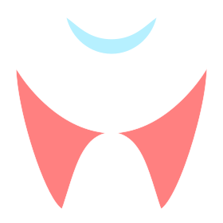

## ZaTribune Dental-Clinic-Desktop V1.0-Single

  
  

### Overview  
Built with complete AWESOMENESS!!.  
I represent to you the DCD [Dental Clinic Desktop], a reliable solution for managing dental clinics.

### Features  

1. The DCD Application provides the user with the ability to record all the patient’s primary data and the ability to search for him/her and create a patient history file for the visitor and display it in the form of a recorded history containing all the previous visits, x-rays, and the medications he used in advance.  
2. The ability to create + print a medical prescription that's provided with a QR code for each one.  
3. The ability to specify a discount rate for the patient.    
4. A user can monitor and see the number of whatever transactions carried out on the clinic and the total revenues and expenses in any specific period of time.  
5. Equipped with a huge set of drugs and diagnoses data, in addition to the ability to control this data in terms of modification, addition or deletion.  
6. Allows the user to specify drugs to be added to a favorites list and then use them later to write the prescription for the patient.  
7. The Application database is very flexible and highly portable as it can be copied or moved quite easily.  
8. A Full follow-up of revenues and expenditures and printing reports for profits and losses and net income for the clinic or medical center.  
9. Supports automatic data completion Autocomplete feature while typing in different fields to facilitate data writing.  
10. Can Support RBAC "Role Based Access Control", to control the information and the privileges available to each user utilizing the Application.  
11. Provides a high degree of data security and privacy, in compliance with HIPAA standards.   

### System Requirements  
- Microsoft Windows OS / Linux-based OS.  
- At least 2 GB RAM.

### Authors  

